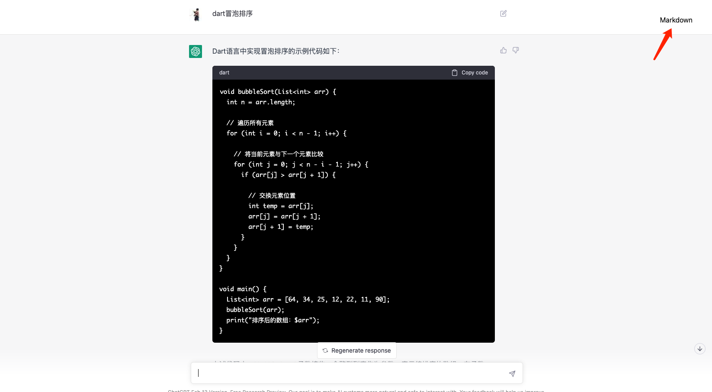
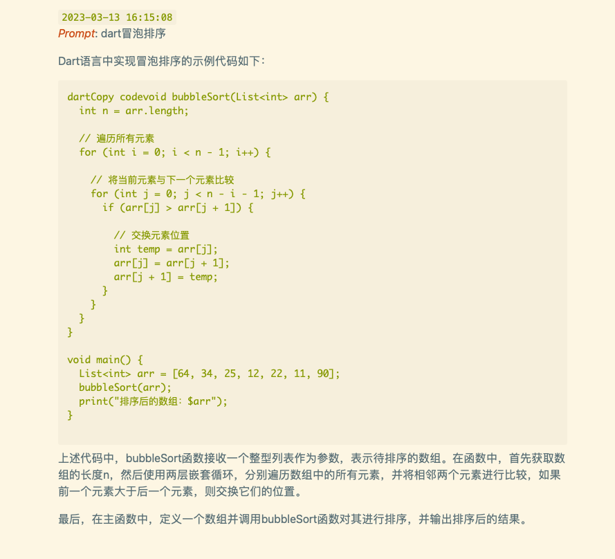

# save_chatgpt
Save ChatGPT session as Markdown

## 截图
点击Markdown按钮保存

保存的Markdown格式

## 参考
保存markdown的js
* https://github.com/ryanschiang/chatgpt-export

chrome插件实现
* https://github.com/wjrmffldrhrl/chatgpt-keeper

